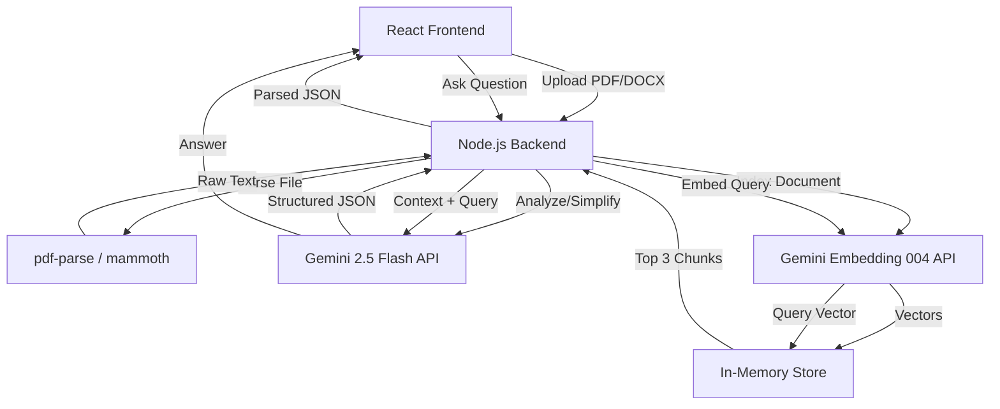

# LegalLens Architecture

## Overview
LegalLens is a full-stack GenAI application built with:
- **Frontend**: React + Vite + Tailwind CSS
- **Backend**: Node.js + Express
- **GenAI**: Google Gemini API (`@google/genai`)

## System Flow

## Security & Data
- User uploaded documents are temporarily saved in `server/uploads/` during text extraction and deleted immediately after.
- Document text and vector embeddings are stored **in-memory only** on the backend using a simple map keyed by a random `sessionId`. When the Node process stops, data is destroyed.
